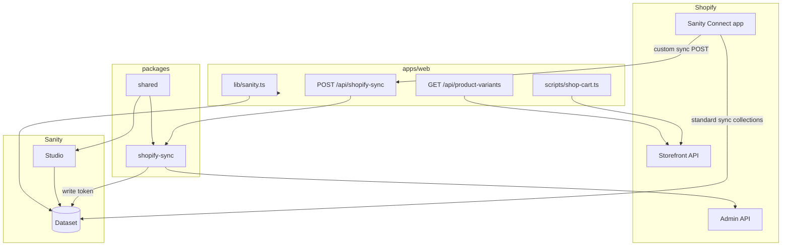

# Architecture blueprint — Astro + Sanity + Shopify monorepo

Use this document as the **single source of truth** when scaffolding a new project (**Astro + Sanity Studio + Shopify on Netlify**). It describes **how the system is shaped**, not individual schemas or pages.

Derived from the **Contra** monorepo and extended with production practices (shared packages, full sync, env validation, preview, CI). **Framework target: Astro 6+ with SSR** (`@astrojs/netlify`).

---

## 1. What you are building

A **two-app npm workspace monorepo** plus **shared packages**:

| Piece | Role | Deploy target |
|-------|------|----------------|
| **`apps/web`** | Astro site: GROQ reads, Storefront cart/checkout, server API routes | `www.example.com` |
| **`apps/studio`** | Sanity Studio: editorial + Shopify-synced catalog | `studio.example.com` |
| **`packages/shared`** | Constants, document ID helpers, env schema types | Not deployed |
| **`packages/shopify-sync`** | **Single** Shopify → Sanity sync implementation | Imported by web API route only |

**Commerce split (non-negotiable):**

- **Shopify** = catalog, inventory, prices, cart, checkout.
- **Sanity** = content, merchandising, SEO, synced product presentation.
- **Never** use Sanity variant GIDs alone at checkout — resolve **live** variant GIDs via Storefront API (§5.6, §8.2).



---

## 2. Repository layout

### 2.1 Target monorepo (Astro)

```text
/
├── package.json                      # workspaces: ["apps/*", "packages/*"]
├── package-lock.json
├── .github/workflows/ci.yml          # build web + studio on PR
├── .gitignore
├── docs/
│   ├── ARCHITECTURE_BLUEPRINT.md
│   └── netlify-setup.md
├── packages/
│   ├── shared/
│   │   ├── package.json
│   │   ├── src/
│   │   │   ├── index.ts
│   │   │   ├── shopify-ids.ts        # shopifyProduct-{id}, brand-{slug}, …
│   │   │   ├── shopify-document-types.ts
│   │   │   └── env.ts                # Zod schemas (shared shapes)
│   │   └── tsconfig.json
│   └── shopify-sync/
│       ├── package.json
│       ├── src/
│       │   ├── index.ts              # runShopifySync(request) → Response
│       │   ├── handler.ts            # transaction logic
│       │   ├── admin.ts              # Admin GraphQL: metafields, metaobjects
│       │   ├── normalize.ts
│       │   └── logger.ts             # structured JSON logs
│       └── tsconfig.json
├── apps/
│   ├── web/
│   │   ├── astro.config.mjs          # output: 'server', adapter: netlify()
│   │   ├── netlify.toml
│   │   ├── src/
│   │   │   ├── layouts/BaseLayout.astro
│   │   │   ├── pages/
│   │   │   │   ├── api/
│   │   │   │   │   ├── shopify-sync.ts      # thin wrapper → packages/shopify-sync
│   │   │   │   │   ├── product-variants.ts  # live Storefront GIDs by handle
│   │   │   │   │   └── …/
│   │   │   │   └── …/                       # routes — out of scope here
│   │   │   ├── components/
│   │   │   │   ├── sections/
│   │   │   │   ├── shop/
│   │   │   │   └── media/
│   │   │   ├── lib/
│   │   │   │   ├── sanity.ts         # client, GROQ, image URLs, typegen imports
│   │   │   │   ├── env.ts            # validate import.meta.env at startup
│   │   │   │   ├── portableText.ts
│   │   │   │   └── shopify-storefront.ts   # server-side Storefront helpers
│   │   │   ├── scripts/
│   │   │   │   └── shop-cart.ts      # client cart; calls /api/product-variants
│   │   │   └── styles/
│   │   ├── public/
│   │   ├── sanity-typegen.json       # optional: GROQ → TS
│   │   ├── .env.example
│   │   └── package.json
│   └── studio/
│       ├── sanity.config.ts
│       ├── sanity.cli.ts
│       ├── structure.ts              # uses SHOPIFY_DOCUMENT_TYPES from shared
│       ├── constants.ts              # re-export or import from @repo/shared
│       ├── schemaTypes/
│       ├── components/
│       ├── .env.example
│       ├── netlify.toml
│       └── package.json
└── e2e/                              # Playwright smoke tests (optional path)
    └── shop.spec.ts
```

**Do not** add a duplicate `netlify/functions/shopify-sync.ts`. One HTTP entry point only: `src/pages/api/shopify-sync.ts`.

### 2.2 Root `package.json` contracts

```json
{
  "name": "project-monorepo",
  "private": true,
  "workspaces": ["apps/*", "packages/*"],
  "scripts": {
    "dev": "concurrently \"npm run dev:web\" \"npm run dev:studio\"",
    "dev:web": "npm run dev --workspace web",
    "dev:studio": "npm run dev --workspace studio",
    "build:web": "npm run build --workspace web",
    "build:studio": "npm run build --workspace studio",
    "typegen": "npm run typegen --workspace web",
    "test:e2e": "playwright test"
  },
  "devDependencies": {
    "concurrently": "^9.2.1"
  }
}
```

- Pin **`engines.node`** (e.g. `>=22.12.0`).
- Single lockfile at repo root.

### 2.3 Astro config requirements (`apps/web/astro.config.mjs`)

```js
import { defineConfig } from 'astro/config';
import netlify from '@astrojs/netlify';

export default defineConfig({
  site: 'https://www.example.com',
  output: 'server',                    // required for API routes + dynamic pages
  adapter: netlify(),
  vite: {
    server: {
      // Webhook testing via ngrok (Vite blocks unknown hosts by default)
      allowedHosts: ['.ngrok-free.app', '.ngrok-free.dev']
    }
  }
});
```

---

## 3. Sanity architecture

### 3.1 One project, one dataset

Studio and web share the same **project ID** and **dataset** (`production` by default). Staging datasets need duplicate Connect linking and env sets.

### 3.2 Document categories

| Category | Examples | `_id` pattern |
|----------|----------|----------------|
| **Singletons** | Intro, shop landing, global settings | Fixed: `intro`, `shop`, `festival` |
| **Editorial** | Artists, FAQ, performances | Auto or slug |
| **Shopify-synced** | `product`, `productVariant`, `brand`, `tag` | From `@repo/shared` helpers |
| **Collections** | `collection` | Standard **Sanity Connect** sync only (not custom webhook) |

**Document ID helpers** live in `packages/shared/src/shopify-ids.ts`:

```ts
export const productDocumentId = (shopifyProductId: number) =>
  `shopifyProduct-${shopifyProductId}`;
export const variantDocumentId = (variantId: number) =>
  `shopifyProductVariant-${variantId}`;
export const brandDocumentId = (slug: string) => `brand-${slug}`;
export const tagDocumentId = (slug: string) => `tag-${slug}`;
```

### 3.3 Shopify product model

- **`product`** = editorial fields + **`store`** (`shopifyProduct`, read-only in Studio).
- **`productVariant`** = separate documents; `product.store.variants` = **references**.
- **`product.store.tags`** → `tag` references; **`store.brand`** → `brand` reference.
- **`product.store.images`** → `shopifyImage[]` (requires **full** custom sync — §4).
- **Deletes:** `store.isDeleted: true`; filter `!store.isDeleted` in all storefront GROQ.

### 3.4 Studio document locks

In `packages/shared/src/shopify-document-types.ts`:

```ts
export const SHOPIFY_DOCUMENT_TYPES = [
  'product',
  'productVariant',
  'collection'
] as const;
```

Use in `structure.ts` / `sanity.config.ts` to:

- Hide “Create new” for synced types where appropriate.
- Route `product` / `productVariant` list items without encouraging duplicate IDs.
- Document in Studio that **`store.*` fields are system-managed**.

Collections: **never** patch in custom sync — Sanity Connect standard sync owns `collection` documents.

### 3.5 GROQ access layer (`apps/web/src/lib/sanity.ts`)

**Single module** for all Sanity reads:

- `createClient({ useCdn: true })` for published content.
- `urlForSanityImage` / `srcSetForSanityImage` — cap width/quality; never raw full-res URLs in HTML.
- Named functions per use case; GROQ co-located with each function.
- Import generated types from **sanity-typegen** where configured (§3.6).
- Empty-safe defaults when env missing (local dev).

**Preview client** (separate factory in same file or `sanity-preview.ts`):

- Uses `SANITY_API_READ_TOKEN` + `perspective: 'previewDrafts'` (or `previewDrafts` + stega if using Visual Editing later).
- Only used from preview routes / draft API — never bundled to client.

### 3.6 Typed GROQ (`sanity-typegen`)

Run from `apps/web`:

```json
{
  "scripts": {
    "typegen": "sanity typegen generate"
  }
}
```

- Point `sanity-typegen` at Studio schema + extracted GROQ from `lib/sanity.ts`.
- Commit generated types to `apps/web/src/sanity/types.ts` (or gitignore + CI generate step).
- **Rule:** when changing GROQ, regenerate types in the same PR.

### 3.7 Portable Text

`lib/portableText.ts` — HTML via `@portabletext/to-html`; custom marks (external links, tracking `data-*`) live here only.

### 3.8 Studio deployment

- `sanity build` → `dist/` on **separate** Netlify site.
- Env: `SANITY_STUDIO_PROJECT_ID`, `SANITY_STUDIO_DATASET` only.
- Depend on `@repo/shared` for `SHOPIFY_DOCUMENT_TYPES` and ID helpers (workspace protocol).

---

## 4. Shopify architecture

### 4.1 Three layers

| Layer | Mechanism | Responsibility |
|-------|-----------|----------------|
| **1. Sanity Connect** | Shopify app | Base sync; **collections**; webhook trigger when custom sync on |
| **2. Custom sync** | `POST /api/shopify-sync` → `packages/shopify-sync` | Products only: images, metafields, tags, brands, variants, editorial **preserve** |
| **3. Storefront API** | Browser + server routes | Cart, checkout, **live** variant resolution |

**Function URL:** `https://<production-domain>/api/shopify-sync` (Astro SSR route, not a duplicate Netlify Function).

### 4.2 Full custom sync (`packages/shopify-sync`)

**Required capabilities** (not a minimal stub):

1. **OPTIONS** — CORS preflight for Sanity Connect.
2. **POST** — handle `create` | `update` | `sync` | `delete` payloads.
3. **Admin GraphQL** per product (when env present):
   - Re-fetch variants (inventory, SKU, price).
   - Metafields in namespace **`data`** (Admin is source of truth).
   - Resolve brand **metaobjects** to human-readable titles (`read_metaobjects`).
4. **Sanity transaction** per request:
   - Upsert `tag` / `brand` docs via `@repo/shared` ID helpers.
   - `createOrReplace` each `productVariant`; patch `product.store`.
   - **`preserve`** top-level editorial fields on `product` (`body`, `seo`, custom fields) — read existing doc before patch, merge after `store` update.
5. **Delete:** soft-delete `store.isDeleted: true` on `shopifyProduct-{id}`.
6. **Structured logging** (§10): JSON lines with `action`, `productCount`, `durationMs`, `error`.

Port logic from `SHOPIFY_SANITY_INTEGRATION.md` / reference `shopify-sync/route.ts` in a mature repo; Contra’s inline route is a **legacy slim version** — new projects use the package.

**Thin Astro route** (`src/pages/api/shopify-sync.ts`):

```ts
import type { APIRoute } from 'astro';
import { runShopifySync } from '@repo/shopify-sync';

export const prerender = false;

export const OPTIONS: APIRoute = (ctx) => runShopifySync(ctx.request);
export const POST: APIRoute = (ctx) => runShopifySync(ctx.request);
```

**Post-sync cache** (§7.3): after successful commit, trigger shop cache bust (webhook to Netlify purge or short `Cache-Control` on shop pages).

### 4.3 Metafields & collections

- Shopify metafields: namespace **`data`** (`data.brand`, etc.).
- Studio `shopifyMetafields` / product fields mirror keys you edit or display.
- **Collections:** Connect standard sync only; GROQ `*[_type == "collection"]` for merchandising; do not expect collection updates from custom sync.

### 4.4 Storefront / cart (client)

`src/scripts/shop-cart.ts` (loaded with `<script>` from shop pages):

- Env via `data-shopify-domain`, `data-storefront-token`, `data-market-country` on `[data-shop-root]` (from `PUBLIC_*` in Astro frontmatter).
- Endpoint: `https://{domain}/api/2024-01/graphql.json`
- Header: `X-Shopify-Storefront-Access-Token`
- `localStorage` cart id.
- **Add to cart flow:** call `GET /api/product-variants?handle=` first; use returned Storefront variant GIDs (§5.6).

### 4.5 Shopify apps / tokens

| Token | App | Used by |
|-------|-----|---------|
| Sanity Connect | Connect | Catalog sync + webhook |
| Admin API | Custom app | `packages/shopify-sync` |
| Storefront | Custom app | Web client + `product-variants` API |

Separate Admin apps if you need customer/membership APIs beyond catalog sync.

---

## 5. Web app architecture (Astro)

### 5.1 Rendering strategy

| Concern | Approach |
|---------|----------|
| Content pages | Astro server render; `await getX()` in frontmatter |
| Shop listing | Server GROQ (`getShopPage`); client script for cart |
| Cart / mini-cart | Client-only `shop-cart.ts` + Storefront |
| `shopify-sync` | `prerender = false`; dynamic always |
| `product-variants` | `prerender = false`; server Storefront query |
| Preview | Dedicated route or cookie + `SANITY_API_READ_TOKEN` (§5.5) |
| Newsletter / secrets | Thin `pages/api/*` → `lib/` |

### 5.2 Directory conventions

| Path | Purpose |
|------|---------|
| `src/layouts/BaseLayout.astro` | Shell, meta, fonts, global CSS imports |
| `src/pages/api/*.ts` | Server endpoints (`APIRoute`, `prerender = false`) |
| `src/components/sections/` | CMS-driven sections |
| `src/components/shop/` | Product cards, cart UI |
| `src/lib/` | Sanity, env, Portable Text, server Shopify — **no UI** |
| `src/scripts/` | Client islands (cart, newsletter, tracking) |
| `src/styles/` | `variables.css` → `globals.css` → components → pages |

### 5.3 API route rules

1. Validate env via `lib/env.ts` (Zod) before work.
2. Never log write or Admin tokens.
3. Honeypot on public forms (e.g. hidden `company` field).
4. CORS on `shopify-sync` for Connect (`Access-Control-Allow-Origin: *` acceptable).
5. **One** sync implementation — `packages/shopify-sync` only.
6. Return consistent JSON: `{ success: boolean, message?: string, … }`.

### 5.4 Environment validation (`apps/web/src/lib/env.ts`)

Validate at module load (server) with Zod:

```ts
import { z } from 'zod';

const serverSchema = z.object({
  SANITY_STUDIO_PROJECT_ID: z.string().min(1),
  SANITY_STUDIO_DATASET: z.string().default('production'),
  SANITY_API_WRITE_TOKEN: z.string().min(1).optional(), // required on sync host
  SANITY_API_READ_TOKEN: z.string().optional(),
  SANITY_STUDIO_SHOPIFY_DOMAIN: z.string().optional(),
  SANITY_STUDIO_SHOPIFY_ADMIN_ACCESS_TOKEN: z.string().optional()
});

const publicSchema = z.object({
  PUBLIC_SANITY_PROJECT_ID: z.string().min(1),
  PUBLIC_SANITY_DATASET: z.string().default('production'),
  PUBLIC_SANITY_API_VERSION: z.string().default('2026-05-11'),
  PUBLIC_SHOPIFY_DOMAIN: z.string().optional(),
  PUBLIC_SHOPIFY_STOREFRONT_ACCESS_TOKEN: z.string().optional(),
  PUBLIC_SHOPIFY_MARKET_COUNTRY: z.string().optional()
});
```

- `getServerEnv()` / `getPublicEnv()` — throw clear errors in CI/build if required keys missing.
- Share schema **shapes** with `packages/shared/src/env.ts` where Studio needs the same IDs.

### 5.5 Draft / preview mode

- **`SANITY_API_READ_TOKEN`** (viewer) on web host only.
- Preview route pattern: `/preview/...` or `?preview=true` guarded by secret cookie / Netlify password for staging.
- Use non-CDN client with preview perspective for fetches on that route.
- Do not expose read token in client bundles or `PUBLIC_*` vars.

Optional later: Sanity Visual Editing + stega — keep preview client isolated in `lib/`.

### 5.6 Live variant resolver API

**Required:** `src/pages/api/product-variants.ts`

- `GET ?handle={shopifyHandle}`
- Server-side Storefront GraphQL `productByHandle` → `{ variants: [{ id, availableForSale, price, … }] }`
- `shop-cart.ts` calls this before `cartLinesAdd` so lines use current GIDs.
- Cache: `Cache-Control: private, max-age=60` or no cache on API.

### 5.7 Image policy

| Source | Rule |
|--------|------|
| Sanity assets | `urlForSanityImage` / `srcset` with width ladder; respect hotspot/crop |
| Shopify CDN | Fixed aspect in CSS; `width`/`height` on `` when known from sync; lazy-load below fold |
| Hero video | Poster image + `<video>`; mobile/desktop breakpoints from singleton docs |

Avoid embedding multi-megabyte Sanity originals.

### 5.8 Markets / i18n (when needed)

- `PUBLIC_SHOPIFY_MARKET_COUNTRY` → Storefront `@inContext(country: $country)`.
- Plan Sanity **internationalized fields** or separate documents early if multi-locale content.
- Same market country on `product-variants` and cart scripts.

---

## 6. Environment variables

### 6.1 `apps/web/.env.example`

```env
# Sanity (public read — Astro PUBLIC_*)
PUBLIC_SANITY_PROJECT_ID=
PUBLIC_SANITY_DATASET=production
PUBLIC_SANITY_API_VERSION=2026-05-11

# Shopify Storefront (public — browser cart)
PUBLIC_SHOPIFY_DOMAIN=your-store.myshopify.com
PUBLIC_SHOPIFY_STOREFRONT_ACCESS_TOKEN=
PUBLIC_SHOPIFY_MARKET_COUNTRY=

# Shopify → Sanity sync (server only — never PUBLIC_)
SANITY_STUDIO_PROJECT_ID=
SANITY_STUDIO_DATASET=production
SANITY_API_WRITE_TOKEN=

# Full sync (server only)
SANITY_STUDIO_SHOPIFY_DOMAIN=your-store.myshopify.com
SANITY_STUDIO_SHOPIFY_ADMIN_ACCESS_TOKEN=

# Preview (server only)
SANITY_API_READ_TOKEN=

# Third-party (server only)
LAYLO_API_TOKEN=
```

### 6.2 `apps/studio/.env.example`

```env
SANITY_STUDIO_PROJECT_ID=
SANITY_STUDIO_DATASET=production
```

### 6.3 Rules

- Same `projectId` / `dataset` everywhere.
- Write + Admin tokens only on **web** Netlify site that serves `/api/shopify-sync`.
- Document every key in `.env.example`; values in Netlify UI / `.env` (gitignored).

---

## 7. Deployment (Netlify)

Two sites — `docs/netlify-setup.md`.

| Site | Base directory | Build | Publish |
|------|----------------|-------|---------|
| Web | `apps/web` | `cd ../.. && npm install --include=optional && npm run build --workspace web` | `dist` |
| Studio | `apps/studio` | `npm run build` | `dist` |

**Web env:** all `PUBLIC_*` + server secrets.

**Connect Function URL:** `https://<domain>/api/shopify-sync`

### 7.1 Local webhook testing

1. `npm run dev:web` (Astro dev server).
2. `ngrok http 4321` (or your Astro port).
3. Sanity Connect → Custom sync → `https://<ngrok-host>/api/shopify-sync`.
4. `astro.config.mjs` `vite.server.allowedHosts` includes ngrok domains.
5. Watch terminal for structured sync logs.

### 7.2 CI (required)

`.github/workflows/ci.yml`:

```yaml
name: CI
on: [pull_request, push]
jobs:
  build:
    runs-on: ubuntu-latest
    steps:
      - uses: actions/checkout@v4
      - uses: actions/setup-node@v4
        with:
          node-version: '22'
          cache: npm
      - run: npm ci
      - run: npm run build:studio
      - run: npm run build:web
      # optional: npm run typegen && git diff --exit-code
```

Fail PRs if either workspace does not build.

### 7.3 Cache invalidation after sync

Astro on Netlify has no Next.js `revalidateTag`. Use one or more of:

- **Short TTL** on shop HTML at CDN (e.g. 60s) if acceptable.
- **Netlify build hook** or **purge API** called from `packages/shopify-sync` after successful transaction (document hook URL in env `NETLIFY_BUILD_HOOK_URL` optional).
- **Version query** on shop data fetches in dev only — production relies on SSR per request (`output: 'server'`).

Default for this architecture: **SSR shop pages** so each request runs fresh GROQ; CDN cache HTML cautiously.

---

## 8. Data-fetching patterns (no page markup)

### 8.1 Singleton + references

Singleton `shop` with curated `products[]` references; GROQ expands variants and filters `!store.isDeleted`.

### 8.2 Listing vs detail vs cart

| Step | Source |
|------|--------|
| Grid order / copy | Sanity GROQ |
| PDP content | Sanity by `store.slug.current` |
| Variant pick / add to cart | `GET /api/product-variants?handle=` → Storefront GIDs |
| Checkout | Storefront `cart.checkoutUrl` |

### 8.3 Images

See §5.7.

---

## 9. Styling & assets

- **Tokens:** `styles/common/variables.css`, `fonts.css`.
- **Layers:** `globals.css` → `main.css` → `components/*` → `pages/*` imported in relevant `.astro` only.
- **`public/`:** favicons, fonts, video; WebP posters for hero backgrounds.
- **Scripts:** prefer `src/scripts/*.ts` + explicit `<script>` in pages that need interactivity (cart, newsletter).

---

## 10. Security & operations

| Topic | Practice |
|-------|----------|
| Secrets | Server env only; Zod validation at boot |
| Webhook | HTTPS + Sanity Connect; optional shared secret header if you add verification |
| Sync idempotency | Fixed document IDs from `@repo/shared` |
| Logging | JSON: `{ "event":"shopify-sync", "action", "productCount", "durationMs", "ok", "error" }` |
| PII | Honeypot on forms; minimal email logging |
| E2E | Playwright: shop loads → add to cart → checkout URL exists (§11) |

---

## 11. Bootstrap checklist (architecture)

### Repository

- [ ] Workspaces: `apps/*`, `packages/*`
- [ ] `packages/shared` + `packages/shopify-sync`
- [ ] No duplicate `netlify/functions/shopify-sync.ts`
- [ ] CI workflow builds web + studio

### Sanity

- [ ] Project + dataset; Studio on subdomain
- [ ] Desk: singletons + locked Shopify types
- [ ] `sanity-typegen` wired in web
- [ ] `lib/sanity.ts` sole GROQ entry point

### Shopify

- [ ] Sanity Connect linked; Sync all
- [ ] Custom sync URL → `/api/shopify-sync`
- [ ] Admin + Storefront custom apps; scopes documented
- [ ] Metafields namespace `data` defined

### Web (Astro)

- [ ] `output: 'server'` + `@astrojs/netlify`
- [ ] `lib/env.ts` Zod validation
- [ ] Thin sync route → `@repo/shopify-sync` (full handler)
- [ ] `GET /api/product-variants`
- [ ] `shop-cart.ts` uses variant resolver before add
- [ ] Preview path with read token (if editors need drafts)
- [ ] `.env.example` complete

### Quality

- [ ] Playwright smoke: shop + cart + checkout URL
- [ ] Structured sync logs in Netlify function logs
- [ ] Editorial fields survive product re-sync

### Verify

- [ ] Shopify product edit → `store.images[]` in Sanity
- [ ] Shopify delete → `store.isDeleted: true`
- [ ] Add to cart uses Storefront GIDs from API
- [ ] Collections sync via Connect (not custom webhook)

---

## 12. E2E testing (Playwright)

Minimal `e2e/shop.spec.ts`:

1. Visit `/shop` (or shop route).
2. Assert product grid renders.
3. Select variant → add to cart (wait for network to `/api/product-variants` and Storefront).
4. Assert mini-cart shows line item and checkout link/href.

Run in CI against Netlify deploy preview or `astro preview` with env secrets in GitHub Actions.

---

## 13. Contra migration notes (this repo)

| Current Contra | Target per blueprint |
|----------------|----------------------|
| Slim `pages/api/shopify-sync.ts` | Move to `packages/shopify-sync` (full handler) |
| Duplicate `netlify/functions/shopify-sync.ts` | **Remove**; Astro API route only |
| Inline GROQ types in `sanity.ts` | Add `sanity-typegen` |
| Cart uses Sanity variant refs directly | Add `/api/product-variants`; update `shop-cart.ts` |
| No `packages/shared` | Extract IDs + `SHOPIFY_DOCUMENT_TYPES` |
| No CI / env Zod | Add workflow + `lib/env.ts` |
| No structured sync logs | Add `logger.ts` in sync package |

---

## 14. Reference files in Contra

| Area | Path |
|------|------|
| Monorepo root | `package.json` |
| Astro config | `apps/web/astro.config.mjs` |
| Sanity + GROQ | `apps/web/src/lib/sanity.ts` |
| Sync (legacy slim) | `apps/web/src/pages/api/shopify-sync.ts` |
| Sync duplicate (remove) | `apps/web/netlify/functions/shopify-sync.ts` |
| Storefront cart | `apps/web/src/scripts/shop-cart.ts` |
| Studio | `apps/studio/sanity.config.ts`, `structure.ts` |
| Shopify guide | `SHOPIFY_SANITY_INTEGRATION.md` |
| Webhook setup | `SHOPIFY_WEBHOOK_SETUP.md` |
| Netlify | `docs/netlify-setup.md`, `apps/web/netlify.toml` |
| Env | `apps/web/.env.example`, `apps/studio/.env.example` |

---

## 15. How to use this with an AI or new repo

1. Scaffold monorepo per §2.1 (Astro web + Studio + `packages/*`).
2. Implement `packages/shared` then `packages/shopify-sync` (full handler per §4.2).
3. Wire thin Astro API routes; configure `astro.config.mjs` per §2.3.
4. Add Zod env, typegen, product-variants API, cart script integration.
5. Copy Shopify **schema types** from template/reference (not page markup).
6. Connect Shopify + Netlify env; run §11 checklist + Playwright §12.

---

## Appendix: porting to Next.js later

If you ever migrate off Astro:

| Astro | Next.js |
|-------|---------|
| `import.meta.env.PUBLIC_*` | `process.env.NEXT_PUBLIC_*` |
| `src/pages/api/*.ts` | `app/api/*/route.ts` |
| `src/layouts/*.astro` | `app/layout.tsx` |
| `src/scripts/*.ts` | `'use client'` modules |
| `@astrojs/netlify` | `@netlify/plugin-nextjs` |
| SSR per request | `revalidateTag('shop')` after sync instead of §7.3 |

Keep `packages/shopify-sync` and `packages/shared` unchanged — only the HTTP adapter in `apps/web` changes.

---

*Framework: **Astro 6+** (SSR, Netlify). Commerce: **Sanity Connect** + **custom sync package** + **Storefront API**.*
